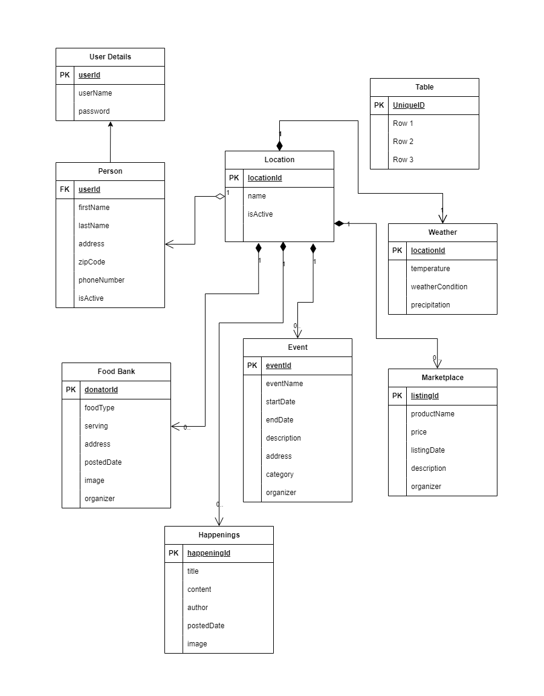

<h1>locAll</h1>

Welcome to locAll, your go-to platform for connecting with local happenings, commerce, and community support! Our web application is designed to bring neighbors together by providing a centralized space for events, marketplace listings, weather updates, and community initiatives—all tailored to your specific location.

Key Features:
<ol>
<li><lh>Location-Centric Experience</lh>
<ld>Navigate through a tailored experience based on your zipcode, ensuring that all information is relevant to your local community.
</ld>
<li><lh>Verified User Publishing</lh>
<ld>Publish your events, marketplace listings, or community initiatives with confidence after completing our robust verification process.</ld>
<li><lh>Event Management</lh>
<ld>Organize and promote local events such as fairs, festivals, and functions. Sell tickets directly through the platform to streamline event planning.</ld>
<li><lh>Dynamic Marketplace</lh>
<ld>Buy and sell products within your community. Post detailed listings with images, descriptions, and pricing to engage with local buyers.</ld>
<li><lh>Real-Time Weather Updates</lh>
<ld>Stay informed about local weather conditions, ensuring that your outdoor plans are always well-informed.</ld>
<li><lh>Happenings Feed</lh>
<ld>Access a single, curated feed showcasing the latest activities, community announcements, and local news in your area.</ld>
<li><lh>Excess Food Sharing</lh>
<ld>Contribute to community well-being by sharing or donating excess food. Receive notifications about available food contributions nearby.</ld>
<li><lh>Subscription and Notification System</lh>
<ld>Tailor your experience by subscribing to specific categories or locations. Receive timely notifications to stay up-to-date with the latest in your community.</ld>
</ol>

Join locAll today and be an active participant in building a vibrant and connected local community. Together, let's make every neighborhood a better place!

<h2>Object Model Diagram</h2>

