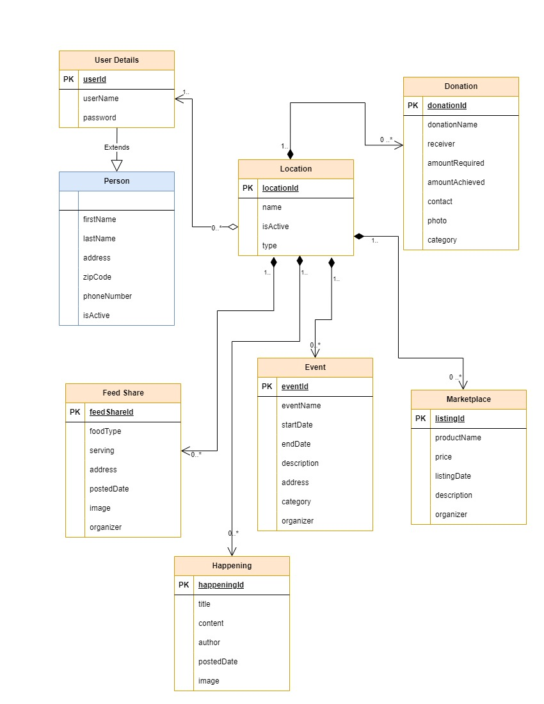

# locAll

## Project Description

Welcome to locAll!
locAll is a community-centric platform designed to connect individuals with local happenings, events, marketplace activities, and community support. Our web application fosters a sense of togetherness by providing a centralized space for location-specific information, creating a vibrant and connected local community.

## Key Features

1. Location-Centric Experience
Navigate through a tailored experience based on your zipcode, ensuring that all information is relevant to your local community.

2. Event Management
Organize and promote local events such as fairs, festivals, and functions, fostering community engagement.

3. Dynamic Marketplace
Buy and sell products within your community. Post detailed listings with images, descriptions, and pricing to engage with local buyers.

4. Real-Time Weather Updates
Stay informed about local weather conditions, ensuring that your outdoor plans are always well-informed.

5. Happenings Feed
Access a single, curated feed showcasing the latest activities, community announcements, and local news in your area.

6. Excess Food Sharing
Contribute to community well-being by sharing or donating excess food, promoting a sustainable and supportive environment.

7. Donation
Support neighbors in need by providing essential donations for various purposes. Strengthen the sense of community care through your generosity.

## Team Members

Ashmiya VijayaChandran (NUID: 002250010)
Thejus Thomson (NUID: 002243261)
Shashikar Anthoniraj (NUID: 002242574)
Pranav Prakash (NUID: 002873007)

## Milestones, User Stories & Task Assignment

<table>
<thead>
<tr>
<th>Milestone</th>
<th>User Story</th>
<th>Assigned To</th>
</tr>
</thead>
<tbody>
<tr>
<td rowspan="6">Milestone 1: User Profile and Login</td>
<td>Create profile UI</td>
<td>Shashikar</td>
</tr>
<tr>
<td>Create User APIs integration</td>
<td>Thejus</td>
</tr>
 <tr>
<td>Create Login View</td>
<td>Pranav</td>
</tr>
 <tr>
<td>Create User APIs</td>
<td>Ashmiya</td>
</tr>
 <tr>
<td>Create layouts for headers, navigation and different tabs</td>
<td>Thejus</td>
</tr>
 <tr>
<td>Take current location and allow user to select location and render elements accordingly</td>
<td>Ashmiya</td>
</tr>
<tr>
<td rowspan="5">Milestone 2: Donations</td>
<td>Create Donation Posting UI</td>
<td>Ashmiya</td>
</tr>
<tr>
<td>Create Donation APIs</td>
<td>Thejus</td>
</tr>
 <tr>
<td>Donation APIs integration</td>
<td>Shashikar</td>
</tr>
 <tr>
<td>Payment and Donation Metrics</td>
<td>Ashmiya</td>
</tr>
 <tr>
<td>Update, Delete Donations</td>
<td>Pranav</td>
</tr>
<td rowspan="4">Milestone 3: Events</td>
<td>Create Events UI with Map feature</td>
<td>Ashmiya</td>
</tr>
<tr>
<td>Create Event APIs</td>
<td>Pranav</td>
</tr>
 <tr>
<td>Event APIs integration</td>
<td>Shashikar</td>
</tr>
 <tr>
<td>Update and delete events</td>
<td>Thejus</td>
</tr>
<td rowspan="4">Milestone 4: Feed Share</td>
<td>Create Food bank UI</td>
<td>Thejus</td>
</tr>
<tr>
<td>Create Food bank APIs</td>
<td>Ashmiya</td>
</tr>
 <tr>
<td>Food bank API integration</td>
<td>Pranav</td>
</tr>
 <tr>
<td>Update and delete feed share</td>
<td>Shashikar</td>
</tr>
<td rowspan="4">Milestone 5: Marketplace</td>
<td>Create Marketplace UI</td>
<td>Pranav</td>
</tr>
<tr>
<td>Create Marketplace APIs</td>
<td>Shashikar</td>
</tr>
 <tr>
<td>Marketplace API integration</td>
<td>Ashmiya</td>
</tr>
 <tr>
<td>Update and delete marketplace</td>
<td>Thejus</td>
</tr>
</tr>
<td rowspan="8">Milestone 6: Happenings</td>
<td>Create Happenings UI</td>
<td>Thejus</td>
</tr>
<tr>
<td>Create Happenings API</td>
<td>Pranav</td>
</tr>
 <tr>
<td>Happenings API Integration</td>
<td>Shashikar</td>
</tr>
 <tr>
<td>Update and delete happenings</td>
<td>Thejus</td>
</tr>
<tr>
<td>Internationalization for components in the application</td>
<td>Ashmiya</td>
</tr>
<tr>
<td>Bug Fixes</td>
<td>Thejus</td>
</tr>
<tr>
<td>work on JWT token for login</td>
<td>Shashikar</td>
</tr>
<tr>
<td>User Profile Editing</td>
<td>Pranav</td>
</tr>
</tbody>
</table>

Join locAll today and be an active participant in building a vibrant and connected local community. Together, let's make every neighborhood a better place!

 ### Object Model Diagram

### External APIs

https://docs.mapbox.com/   
https://stripe.com/docs/payments  
https://openweathermap.org/guide  
https://recharts.org/en-US/guide  

 ### Instructions to use the repo
- You can clone the repo by using HTTP: 

https://github.com/info-6150-fall-2023/final-project-ex-span-dables.git

OR set up the SSH Key using: 

git@github.com:info-6150-fall-2023/final-project-ex-span-dables.git

Commands to use: 

git clone `<use HTTP Link or SSH Link>`